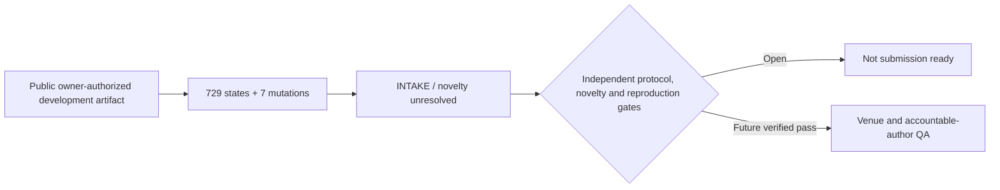

# Assurance-Lattice Receipts for Fail-Closed EVM Inference Credit

## A Reproducible Development Study

> **Development draft — not submission ready.** Novelty, protocol independence,
> external reproduction, final authorship metadata, venue approval, and final human
> approval remain open.

Repository owner, draft-research attribution, and public-release authority:
**Zubaer Mahmood Zubraj** ([`@zmzubraj`](https://github.com/zmzubraj)).
The owner authorized this repository to remain publicly accessible on
30 August 2026. Final byline order, affiliations, CRediT roles, declarations,
and submission approval remain separate accountable-human fields.

This repository contains the complete evidence-gated Minimum Publishable
Prototype (MPP) research system for Assurance-Lattice Receipts (ALR): a typed,
non-compensating receipt-to-credit gate implemented separately in Python and
Solidity and evaluated over a frozen finite development model.

Run ID: `poi-alr-mpp-20260829T044029Z-b4e6442a-cd74f3`

## Current evidence boundary

The development evaluation covers 729 enumerated assurance states and seven
prespecified single-fault mutations. Within that bounded model:

- false activation was `0/728` among non-all-pass states;
- the sole all-pass state activated (`1/1`);
- Python reason-code agreement was `729/729`;
- all seven named mutations were rejected; and
- Python–Solidity shared-vector agreement was `736/736`.

These are same-producer, development-only conformance results. They do **not**
establish semantic correctness, complete attack coverage, production safety,
material novelty, field validity, or independent replication. The earlier PoI
C3 result (`FAR = 0.500 > alpha_sem = 0.25`) remains preserved as negative
context and is not relabeled as ALR validation.

## Start here

- Paper PDF: [`07-manuscript/latex/main.pdf`](07-manuscript/latex/main.pdf)
- Frontiers-format draft: [`09-submission/frontiers-in-blockchain-technology-code/frontiers-manuscript.pdf`](09-submission/frontiers-in-blockchain-technology-code/frontiers-manuscript.pdf)
- Manuscript source: [`07-manuscript/manuscript.md`](07-manuscript/manuscript.md)
- Research-system index: [`INDEX.md`](INDEX.md)
- Reproducibility report: [`05-analysis/reproducibility-report.md`](05-analysis/reproducibility-report.md)
- External review packet: [`08-validation/EXTERNAL_REVIEW_PACKET.md`](08-validation/EXTERNAL_REVIEW_PACKET.md)
- Human/scientific gate runbook: [`00-governance/EXTERNAL_HUMAN_SCIENTIFIC_GATE_RUNBOOK.md`](00-governance/EXTERNAL_HUMAN_SCIENTIFIC_GATE_RUNBOOK.md)

## Reproduce the bounded development evaluation

From the repository root:

```bash
python3 implementation/python/run_full_evaluation.py
python3 09-submission/verify_minimum_artifact_bundle.py \
  09-submission/packages/poi-alr-mpp-minimum-artifact-bundle-v1.tar.gz
```

For a fresh-directory reproduction candidate run:

```bash
output_dir=$(mktemp -d /tmp/poi-alr-reproduction.XXXXXX)
python3 implementation/python/external_reproduction_candidate.py \
  --case-root . \
  --output-dir "$output_dir"
```

A successful local run is still candidate evidence only. Independent status
requires a qualified reviewer-controlled environment, exact artifact hashes,
documented conflicts and deviations, and a signed verification event.

## Repository structure

```text
00-governance/   intake, state, provenance, authorization, external gates
01-novelty/      bounded prior-art search, claim specification, novelty matrix
02-feasibility/  pilot, maturity ceiling, risk and progression criteria
03-design/       protocol, analysis plan, precision and deviations
04-data/         authorized generated development data and provenance
05-analysis/     primary, exploratory, robustness and negative findings
06-visuals/      editable diagrams, figure data and publication tables
07-manuscript/   manuscript, claim mapping, LaTeX source and draft PDF
08-validation/   producer-owned adversarial QA and external-review packet
09-submission/   venue dossier, Frontiers-format draft and artifact bundle
implementation/ Python reference model, Solidity gate and tests
```

## Governance and release status

The authoritative controls are `program-state.json`, `artifact-registry.csv`,
`orchestration-plan.json`, and the governance ledgers. File existence, a clean
build, exact hash agreement, or polished prose does not imply scientific
verification or publication readiness.

Current canonical status:

- phase: `INTAKE`;
- novelty: `UNRESOLVED`;
- solution viability: `ASSERTED_ONLY`;
- postdoctoral AI audit: `UNASSESSED`; and
- acceptance readiness: `NOT_ASSESSABLE`.

Draft-research attribution and public hosting are recorded above. Final author
order, affiliations, CRediT roles, funding, competing interests, final licence,
archival DOI, and journal submission remain unresolved. No repository-wide
reuse licence is granted until an accountable author selects and records one.


